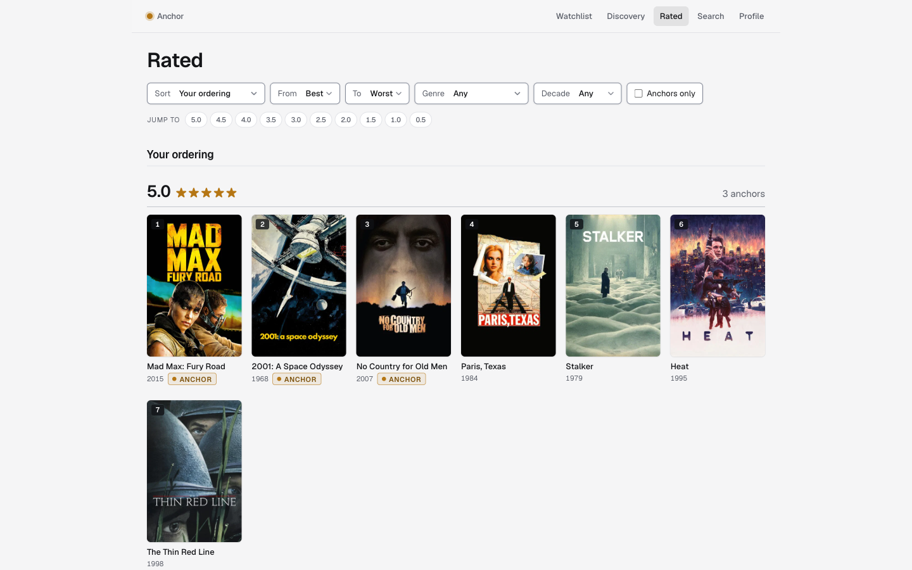
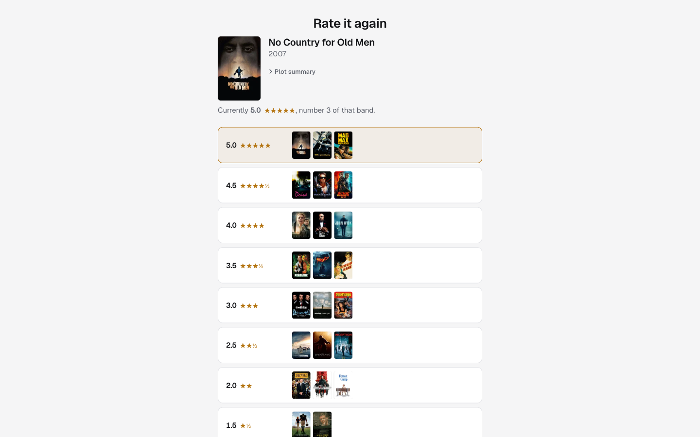
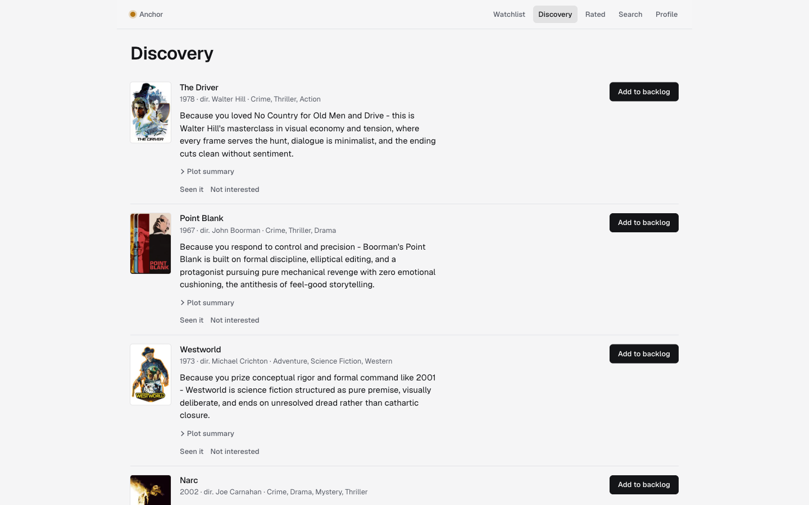
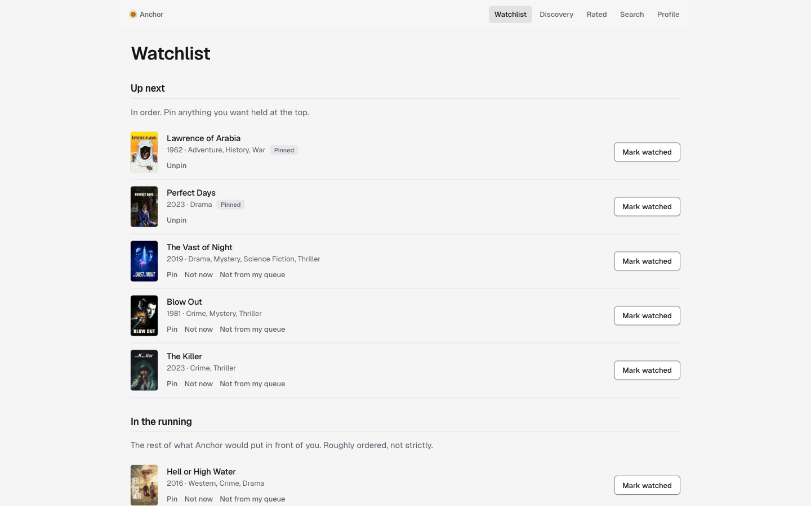
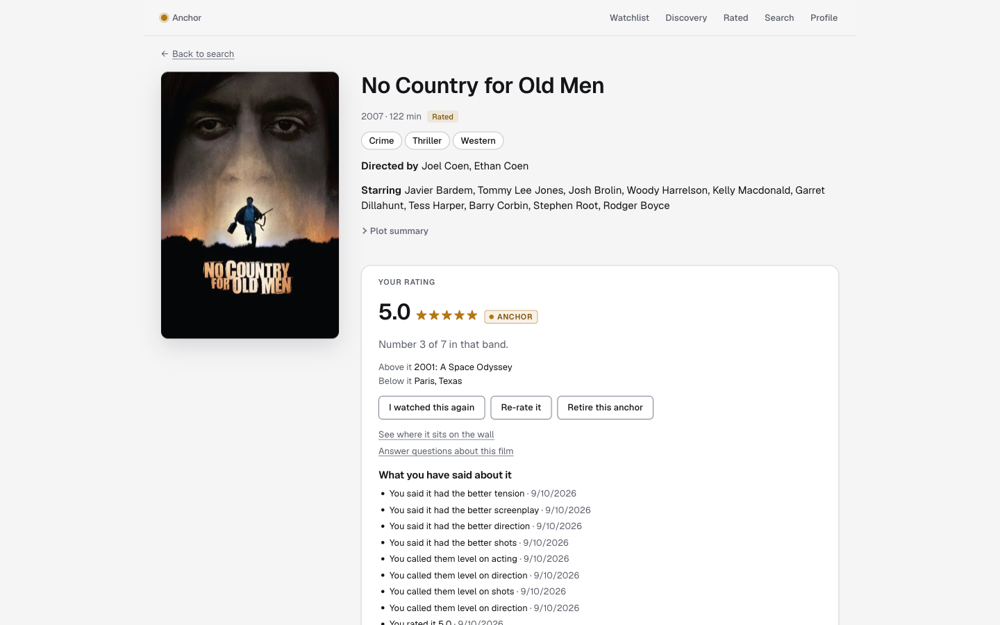

# Anchor

**A personal movie taste-engine.**
Rate films by comparing them with the ones you are sure of, order everything by hand on a poster wall, and let a recommendation engine learn your taste from that ordering.

Live at **[anchorfilms.app](https://anchorfilms.app)**.
The landing page has an **Explore the demo** button that opens a fully lived-in read-only account, no signup needed.

[](https://anchorfilms.app)

## Why it exists

Star ratings drift.
A 4.0 given in 2019 and a 4.0 given last week rarely mean the same thing, and nothing on Letterboxd or IMDb ever asks you to reconcile them.
Anchor replaces the absolute scale with a relative one that is always anchored to your own judgments:

- **Anchors.**
  You mark the films you are certain of: a definitive 5.0, a definitive 3.5.
  They become the reference points every new rating is measured against.
- **The band picker.**
  Rating a film means picking its half-star band while looking at the anchors of each band.
  Unsure between two bands?
  Pick the range and Anchor asks a couple of pairwise questions against those anchors to settle it.
  You never type a number.
- **The wall.**
  Every rated film sits in a strict order within its band, stamped with its rank, on a wall of posters you drag to edit.
  The order is explicit persisted state.
  Nothing on the wall ever moves unless you move it.
- **A watchlist that ranks itself.**
  Once the engine knows your taste, the top of your watchlist is generated and maintained for you.
  Pin what you want held at the top and the rest is ordered by how much you are likely to love it.
- **Discovery.**
  Films you have never added, each with one line explaining the pick in terms of your own films: "Because you loved No Country for Old Men and Drive."

Anchor complements Letterboxd rather than replacing it.
A one-time import of your Letterboxd export builds the wall, the backlog, and your watch history in one step.

## Screenshots

| The band picker | Discovery |
| --- | --- |
|  |  |

| The watchlist | A film page |
| --- | --- |
|  |  |

## How the engine works

Anchor learns one **taste profile** per account from the ordering alone, made of three artifacts that are regenerated on change and never incrementally patched.

**The weight vector** is the only scorer that runs at request time.
It is a feature-parameterised Bradley-Terry model: logistic regression over the difference between two films' TMDB feature vectors (genres, director, top cast, idf-weighted keywords, vote and popularity priors), implemented from scratch in numpy.
Training pairs are read out of the wall the way the owner means it.
Across bands, order is a judgment, so those pairs carry full weight and the band gap teaches magnitude.
Within a band, order is a range, so neighbours train as near-equals and only real separation counts.
It retrains from scratch on every change to the ordering, in milliseconds, so it can never be subtly out of date with the judgments it summarises.

**The exemplar set** is the anchors plus the ordering's extremes, and it grounds every explanation the app shows.

**The prose profile** is an owner-readable description of their taste, maintained by an LLM and versioned.
It drives discovery reranking.
The owner can read it and correct it, and corrections are stored as structural constraints that every regeneration must respect.

**LLMs are precompute-only.**
One module exposes Anchor's four LLM jobs (rerank candidates, regenerate the prose profile, tag a film's qualities, suggest qualities), each schema-validated behind a provider adapter.
Only the background worker imports that module, so no interactive request can ever wait on a model call.
Every call writes to an append-only spend ledger, checked against a per-account cap and a platform-wide cap before each dispatch.
Hitting a cap, losing the credential, or a provider outage all degrade to cached results, never to a broken screen or a runaway bill.

**Nothing runs on calendar time.**
Every cooldown and staleness measure is counted in the owner's own activity (watches logged, feed refreshes), so a dormant account changes nothing and costs nothing.

The full design lives in [docs/design/](docs/design/), with the vocabulary in [CONTEXT.md](CONTEXT.md) and the reasoning behind each decision in the [ADRs](docs/adr/).

## Stack

| Layer | Choice |
| --- | --- |
| Backend | Python 3.13, FastAPI, SQLAlchemy, Alembic, numpy |
| Background jobs | [procrastinate](https://procrastinate.readthedocs.io/), a PostgreSQL-backed queue with transactional enqueue and no Redis |
| Database | PostgreSQL 17 |
| Frontend | React 19, TypeScript, Vite, React Router, dnd-kit for the wall |
| Auth | Hand-built: argon2 password hashing, server-side sessions, httpOnly cookies, email verification through Resend |
| External data | TMDB for film metadata and posters, Letterboxd CSV export for the seed import, Anthropic for the LLM jobs |
| Infrastructure | One Docker image for the web and worker processes, Caddy for HTTPS and static files, Docker Compose on a single VPS |
| CI/CD | GitHub Actions: lint, typecheck, tests, a browser smoke suite over the full stack, then push-to-main deploy |
| Observability | Sentry on the backend and frontend, a `/api/health` endpoint that reports web, database, worker, queue depth, and LLM spend |

The web process and the worker run from the same image with different commands.
The recommendation engine is an imported module called by both, never a separate service.

## Testing

The bar is set in [docs/design/testing.md](docs/design/testing.md).
Every behaviour test speaks HTTP to the FastAPI app over a throwaway real PostgreSQL: each test gets a database cloned from a migrated template, and background jobs run inline inside the test, so a flow that spans the web and worker processes is still one test.
Nothing inside the engine is mocked.

Three fakes stand at the edges: TMDB and Resend at the HTTP boundary, and the LLM operations seam, scripted per test with canned verdicts, tags, and prose.
No automated test ever calls a real provider.

The backend suite is 669 tests, written as flows in the domain vocabulary (rate, narrow a range, move, re-rate, mark an anchor) rather than per-endpoint units, with shared invariant helpers run after every mutating flow.
A Playwright smoke suite of fifteen journeys runs over the full composed stack in CI and covers wiring, not behaviour.

## Repository layout

- `backend/` - the Python API and the background worker.
  `backend/src/anchor/` is the app; `backend/tests/` is the suite; `backend/sql/evaluation/` holds the operator's read-only recommender-quality queries; `backend/tools/` holds the fakes the dev stack runs against.
- `frontend/` - the React + TypeScript single-page app.
  `frontend/e2e/` is the browser smoke suite.
- `docs/design/` - the design spec, one doc per subsystem.
  `docs/adr/` - the architecture decision records.
  `docs/research/` - the sourced groundwork behind the recommender and data-source decisions.
- `deploy/` - everything that lands on the server: the production Compose file, Caddyfile, backup scripts, and the setup wizard.
  See [deploy/README.md](deploy/README.md).
- `Dockerfile`, `docker-compose.yml`, `Caddyfile` - the composed stack.

## Running locally

Docker is the only requirement.

```sh
docker compose up --build --wait
```

This brings up PostgreSQL, a one-shot migration, the web process, the worker, Caddy, and three fakes so the stack needs no credentials: a fake Resend, a fake TMDB over a fixed handful of films, and a fake Anthropic.
It then rebuilds the demo account from the checked-in fixture.

- The app is at <http://localhost> (set `ANCHOR_HTTP_PORT` to move it).
- Sent mail lands at <http://localhost:8025/emails>, so a verification link is one click away.
- PostgreSQL is published on port 5433 (`ANCHOR_POSTGRES_PORT`).
- `GET /api/health` reports web, database, and worker health, and answers 503 when any of the three is down.

To run against real services, set `ANCHOR_TMDB_ACCESS_TOKEN`, `ANCHOR_ANTHROPIC_API_KEY`, `ANCHOR_RESEND_API_KEY`, `ANCHOR_MAIL_FROM` on a domain verified with Resend, and `ANCHOR_PUBLIC_URL` (the base of emailed links).
The session cookie is `Secure` by default (`ANCHOR_COOKIE_SECURE`), which browsers honour on `http://localhost` but nowhere else without HTTPS.

## Developing

Backend, in `backend/` (tests need the compose PostgreSQL running, or `ANCHOR_TEST_ADMIN_DATABASE_URL` pointing at any PostgreSQL that may create databases):

```sh
uv sync
uv run pytest
uv run ruff check && uv run ruff format --check && uv run mypy
uv run uvicorn anchor.main:app --reload   # the web process, on :8000
uv run python -m anchor.worker            # the worker process
uv run alembic upgrade head               # migrations
```

Frontend, in `frontend/`:

```sh
npm install
npm run dev            # proxies /api to the backend on :8000
npm run lint && npm run format:check
npm run build          # typecheck + production build
npm run smoke          # Playwright, against ANCHOR_BASE_URL (default http://localhost)
```

CI runs all of the above plus the smoke suite over `docker compose`; [`.github/workflows/ci.yml`](.github/workflows/ci.yml) is the authority.
`main` is protected, and every merge to it deploys.

## Deployment

A merge to `main` runs the test jobs, builds the images, pushes them to GHCR tagged with the commit SHA, syncs the `deploy/` directory to the box, and restarts the stack with `docker compose up --wait`.
The job then smokes the live site.
Rolling back is re-running the deploy job of the last good commit, since the old image is still on GHCR.
A systemd timer on the host ships a nightly `pg_dump` to object storage, independent of the app so backups keep running even when it is down.
Details in [deploy/README.md](deploy/README.md).

## Data sources

Film metadata and posters come from [TMDB](https://www.themoviedb.org/).
This product uses the TMDB API but is not endorsed, certified, or otherwise approved by TMDB.
Posters are hotlinked from TMDB's CDN and only paths are stored; still-referenced films are re-fetched on a rolling basis inside TMDB's caching terms.
TMDB content and the taste profile are sent only to AI providers whose terms bar training on customer inputs by default, a rule enforced in code at the LLM seam ([ADR 0003](docs/adr/0003-tmdb-licensing-posture.md)).

Anchor has no live Letterboxd connection.
The one-time seed import of a Letterboxd export is the only data that crosses over.

## License

[MIT](LICENSE).
